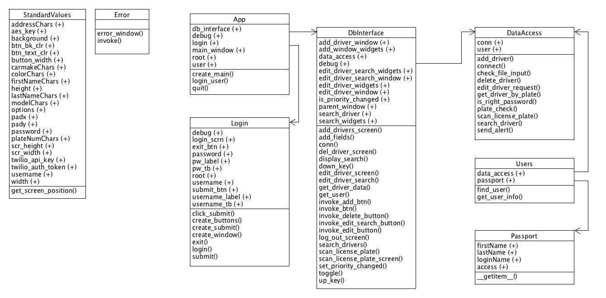

# License Plate Recognition Program

## Team Members
* Jesse Jamieson Abando
* Brian Catrett
* Alexander Hillegass
* James Upchurch

## Vision Statement
  
  Since 2006, 2,323 AMBER alerts have occured across the United States. About 200 alerts are generated per year, meaning over 200 children are abducted each year. These alerts almosts always include vital information for motorists to alert authorities if a given vehicle is spotted. This effort could be consolidated and improved using artificial intelligence to analyze traffic camera feed to search for vehicles of interest.
  
  Using the License Plate Recognition Program, a passive, yet more efficient approach can be taken to finding missing children. Instead of relying on the occupied memories of drivers across the country, an automated system can maintain a scalable search for important vehicles, notifying authorities when an involved vehicle is found.
  

## To install openALPR (Windows/Powershell, Python 3.X)
1.  Navigate to your github clone directory in your file system using 'cd' on powershell: C:\YOUR_PATH\main\OpenALPR\openalpr-2.3.0\openalpr-2.3.0\src\bindings\python

2. Type: "python setup.py install --record files.txt"

3. Test it! Navigate to this directory with 'cd': C:\YOUR_PATH\main\OpenALPR\openalpr-2.3.0-win-64bit\openalpr_64

4. Type: "./python_test.bat"

5. You can use my personal test with a file I uploaded (ferrari.jpg) into the "\python" subdirectory in this directory: type "./python_test2.bat"
## Sprint 1

* [Product Backlog](https://docs.google.com/spreadsheets/d/1lSt2IkeWZkcXEEomajb0V5m8mf8IrMCRReRq9BhTCic/edit#gid=402146333)
* [Sprint Backlog](https://docs.google.com/spreadsheets/d/1lSt2IkeWZkcXEEomajb0V5m8mf8IrMCRReRq9BhTCic/edit#gid=0)
  * [Burndown Chart](https://docs.google.com/spreadsheets/d/1lSt2IkeWZkcXEEomajb0V5m8mf8IrMCRReRq9BhTCic/edit#gid=373722761)
* [Requirements](https://docs.google.com/document/d/146rgft-78nVKI0P4Wdcj7a0kT8OkKUM96-g3gY-bAlk/edit)
* Design Documents
  * System Architecture: [Architecture Diagram](https://docs.google.com/drawings/d/1XAnm92Z1MRIXftqTqmJtPI9S8-kcRq_8Xsm7Hkfhr3U/edit) - [GUI](https://docs.google.com/drawings/d/1q2VkqsfDRKpq601CHK0Ne6fn4U42gQo-iotT8xGuoLw/edit)
  * Class Diagrams
  * Sequence Diagrams
  * etc.
* Source Code
* Test Cases: please see the demo below for the manual test
* [Product Demonstration](https://www.youtube.com/watch?v=TdoFvpXtwX8)

## Sprint 2

* [Product Backlog](https://docs.google.com/spreadsheets/d/1lSt2IkeWZkcXEEomajb0V5m8mf8IrMCRReRq9BhTCic/edit#gid=402146333)
* [Sprint Backlog](https://docs.google.com/spreadsheets/d/1lSt2IkeWZkcXEEomajb0V5m8mf8IrMCRReRq9BhTCic/edit#gid=296008547)
  * [Burndown Chart](https://docs.google.com/spreadsheets/d/1lSt2IkeWZkcXEEomajb0V5m8mf8IrMCRReRq9BhTCic/edit#gid=2069162242)
* [Requirements](https://docs.google.com/document/d/146rgft-78nVKI0P4Wdcj7a0kT8OkKUM96-g3gY-bAlk/edit)
* Design Documents
  * System Architecture [Architecture Diagram](https://docs.google.com/drawings/d/1XAnm92Z1MRIXftqTqmJtPI9S8-kcRq_8Xsm7Hkfhr3U/edit) - 
  * [GUI](https://docs.google.com/drawings/d/1q2VkqsfDRKpq601CHK0Ne6fn4U42gQo-iotT8xGuoLw/edit)  -  [GUI Description](https://docs.google.com/document/d/1v8ZkGkWPdy0DjDnXsMmCImc-LImmenLz9Dxw8cy_ztQ/edit)
  * [Class Diagram](https://docs.google.com/drawings/d/1OuwSf7QMN0vdC2wvWqQbCiYai3YU6PSl9W0EutPnB5E/edit) - [Class Description](https://docs.google.com/document/d/19hM4XHOuAUfJTQXVzCPlpUlnj5RoBN39K19r_ryp1Ng/edit)
* Source Code
* Test Cases : [GUI DB Functionality Tests](https://docs.google.com/document/d/1TgKMqyY3Vg__-QeM3nbDgczyFEK-wBO_RmyLHEpXcDQ/edit)
             ; [Plate Reading Functionality Test](https://docs.google.com/document/d/1Cb24DZv_-YiFCy3ZAx7_2g_3tJZw0N5j6uxCfE3QB-8/edit?usp=sharing)
             ; [OpenALPR Test](https://docs.google.com/document/d/1sGJ7OmW0XctVO17Qo_EiuWaBraP-bcqW6z251UhmmnQ/edit)
* Product Demonstration[GUI BD Functionality Demo](https://www.youtube.com/watch?v=df6LavuaJU8&feature=youtu.be)

## Sprint 3

* [Product Backlog](https://docs.google.com/spreadsheets/d/1lSt2IkeWZkcXEEomajb0V5m8mf8IrMCRReRq9BhTCic/edit#gid=402146333)
* [Sprint Backlog](https://docs.google.com/spreadsheets/d/1lSt2IkeWZkcXEEomajb0V5m8mf8IrMCRReRq9BhTCic/edit#gid=296008547)
* [Burndown Chart](https://docs.google.com/spreadsheets/d/1lSt2IkeWZkcXEEomajb0V5m8mf8IrMCRReRq9BhTCic/edit#gid=2069162242)
* [Requirements](https://docs.google.com/document/d/146rgft-78nVKI0P4Wdcj7a0kT8OkKUM96-g3gY-bAlk/edit)
* Design Documents
* System Architecture [Architecture Diagram](https://docs.google.com/drawings/d/1XAnm92Z1MRIXftqTqmJtPI9S8-kcRq_8Xsm7Hkfhr3U/edit) - 
* [GUI](https://docs.google.com/drawings/d/1q2VkqsfDRKpq601CHK0Ne6fn4U42gQo-iotT8xGuoLw/edit)  -  [GUI Description](https://docs.google.com/document/d/1v8ZkGkWPdy0DjDnXsMmCImc-LImmenLz9Dxw8cy_ztQ/edit)
*
* [Class Diagram](https://docs.google.com/drawings/d/1OuwSf7QMN0vdC2wvWqQbCiYai3YU6PSl9W0EutPnB5E/edit) - [Class Description](https://docs.google.com/document/d/19hM4XHOuAUfJTQXVzCPlpUlnj5RoBN39K19r_ryp1Ng/edit)
* Source Code
* Test Cases : [GUI DB Functionality Tests](https://docs.google.com/document/d/1TgKMqyY3Vg__-QeM3nbDgczyFEK-wBO_RmyLHEpXcDQ/edit)
; [Plate Reading Functionality Test](https://docs.google.com/document/d/1Cb24DZv_-YiFCy3ZAx7_2g_3tJZw0N5j6uxCfE3QB-8/edit?usp=sharing)
; [OpenALPR Test](https://docs.google.com/document/d/1sGJ7OmW0XctVO17Qo_EiuWaBraP-bcqW6z251UhmmnQ/edit)
* Product Demonstration[GUI BD Functionality Demo]()
